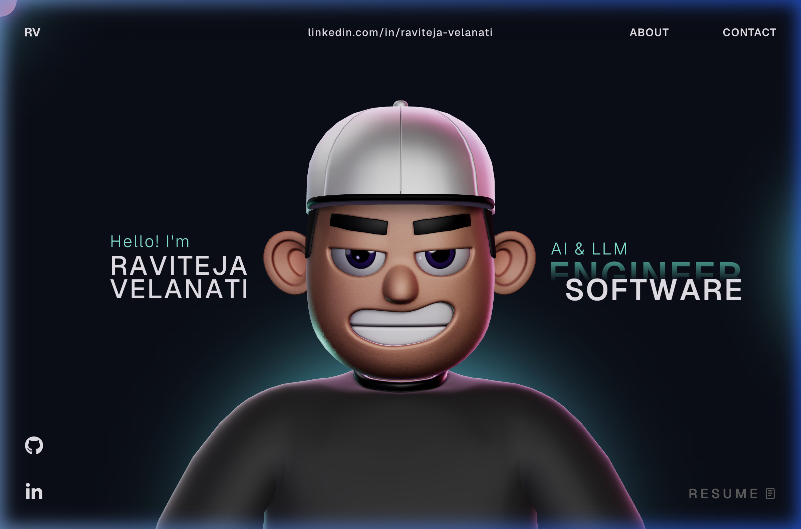

# Raviteja Velanati — 3D Portfolio

AI & LLM Software Engineer (3.5+ years) building reliable AI infrastructure across LLM evaluation, human-in-the-loop workflows, and data pipelines.

🔗 **[View Live Site →](https://3d-portfolio-teal-nu.vercel.app)**

---

---

Built with React, TypeScript, Three.js, GSAP, and deployed on Vercel.

📧 tejareddi0011@gmail.com · [LinkedIn](https://www.linkedin.com/in/raviteja-velanati/) · [GitHub](https://github.com/ravitejav-dev)
